# AWS S3 Cross-Region Replication (CRR) using Terraform

## 🎯 Objective

The objective of this project is to implement **AWS S3 Cross-Region Replication (CRR)** using **Terraform**. This setup automatically replicates objects from a source S3 bucket in one AWS region to a destination S3 bucket in another region, enabling high availability, backup, and disaster recovery.

---
## 🧰 Technologies Used
- AWS S3
- AWS IAM
- Terraform
- AWS CLI

---
## 📁 Project Structure

aws-s3-crr-terraform/
|── screenshots/
│   ├── screenshot1.png
│   ├── screenshot2.png
│   └── screenshot3.png
|
|── .gitignore
│── provider.tf
│── main.tf 
│── variables.tf
│── outputs.tf
│── terraform.tfvars
│── README.md

---
## 🏗️ Architecture Diagram

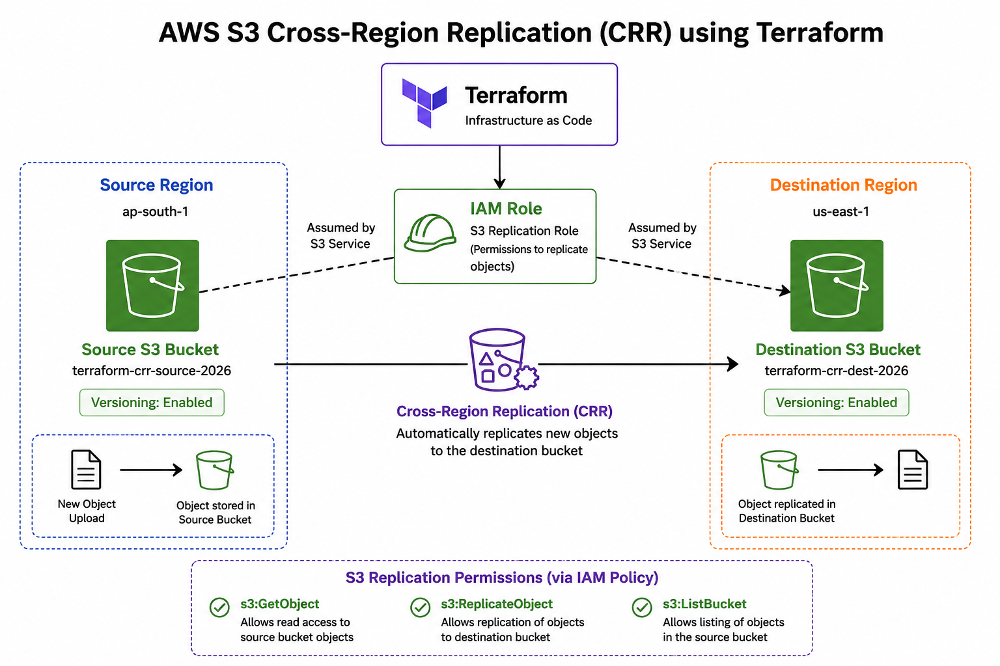

### Flow:
Terraform → IAM Role → Source S3 Bucket → Cross-Region Replication → Destination S3 Bucket

---
## ⚙️ Prerequisites
Before starting, ensure you have:
- AWS Account
- IAM user with S3 + IAM permissions
- Terraform installed (>= 1.5)
- AWS CLI installed and configured

### Check versions:
```bash
terraform -version
aws --version
```
output:
   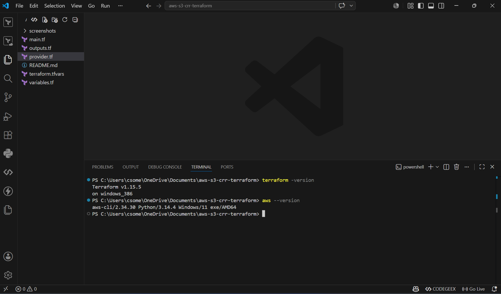
   
---
## 🔄 Project Workflow

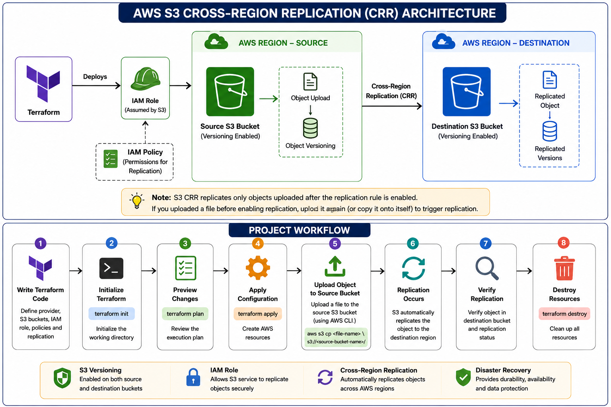

### Workflow Steps
1. terraform init
2. terraform plan
3. terraform apply
4. terraform output
5. aws s3 cp test.txt s3://source-bucket
6. Verify replication status
7. Check destination bucket
8. terraform destroy

---
## ⛏️Implementation

## 🚀 Step 1: Initialize Terraform

### 🎯 Objective:
- Initialize the Terraform working directory. This downloads the required provider plugins (AWS) and sets up the backend environment for execution.

### 📌 Command:
```bash
terraform init
```
output:
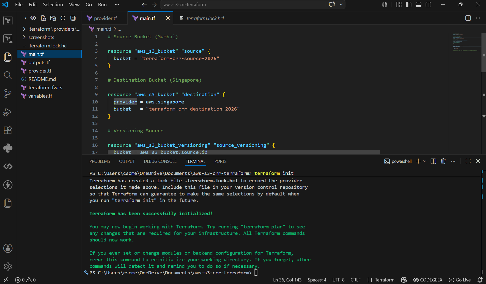

---
## 🚀 Step 2: Plan the Terraform Configuration

### 🎯 Objective:
- Generate an execution plan to understand the changes that will be made to the AWS infrastructure.

### 📌 Command:
```bash
terraform plan
```

output:
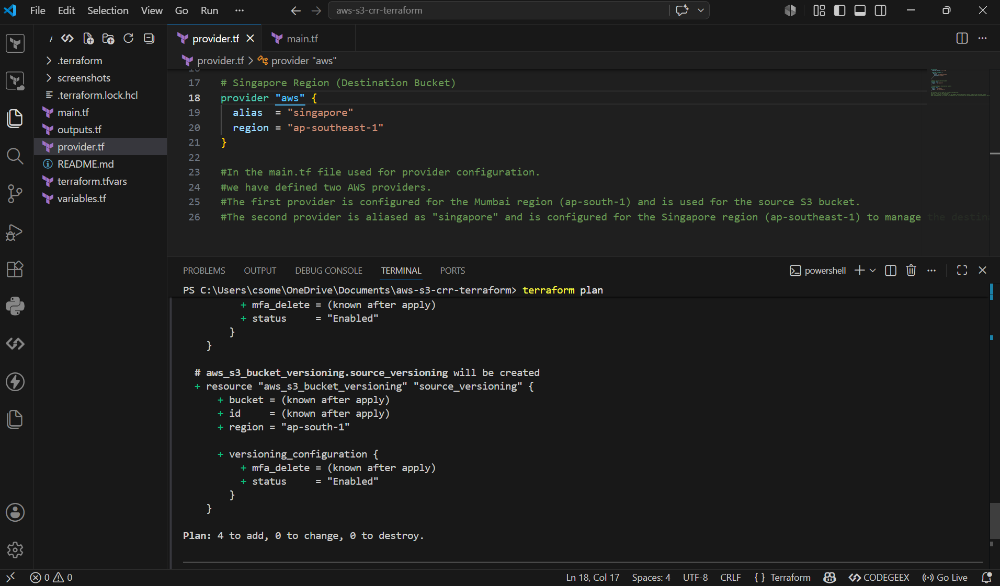

---
## 🚀 Step 3: Apply the Terraform Configuration

### 🎯 Objective:
- Apply the Terraform configuration to create the resources in AWS.
- Create AWS resources such as:
         * Source S3 bucket
         * Destination S3 bucket
         * IAM role & policy
         * Replication configuration
### 📌 Command:
```bash
terraform apply
```
output:
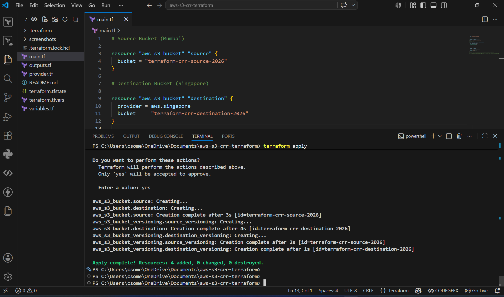

---
## 🚀 Step 4: Verify AWS Resources Created

### 🎯 Objective:
- Confirm that all AWS resources are created successfully in aws console:

### 📌 What to check in AWS Console:
1️⃣ S3 Buckets
- Source bucket exists
- Destination bucket exists

2️⃣ IAM Role
- Replication role exists
- Trust relationship with S3 service

3️⃣ IAM Policy
Permissions include:
- s3:GetObject
- s3:ReplicateObject
- s3:ListBucket

4️⃣ Replication Rule
- Enabled in Source bucket → Management → Replication rules

### 📌 Command (Optional check):
```bash
terraform output
```
---
## 🚀 Step 5: Verify Source and Destination Buckets in AWS Console

### 🎯 Objective:
- Verify that the source and destination buckets have been created in the AWS console.

### 📌 Command:
```bash
terraform output
```
output:
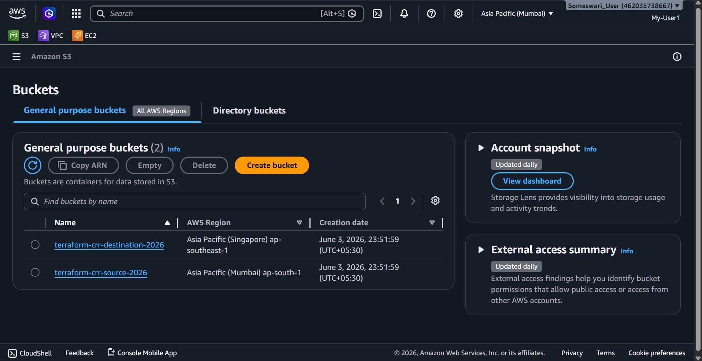

---
## 🚀 Step 6: Source  Bucket versioning enabled in AWS Console

### 🎯 Objective:
- Verify that versioning is enabled for the source bucket in the AWS console.

Output:
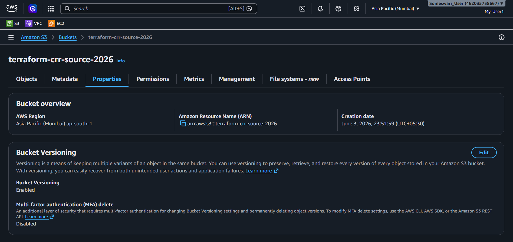

---
## 🚀 Step 7: Destination Bucket versioning enabled in AWS Console

### 🎯 Objective:
- Verify that versioning is enabled for the destination bucket in the AWS console.

Output:
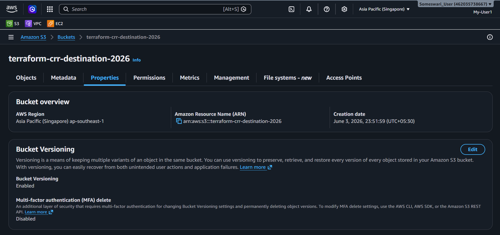

---
## 🚀 Step 8: File Uploaded to Source Bucket using aws cli

### 🎯 Objective:
- Verify that a file has been uploaded to the source bucket using the AWS CLI.

### 📌 Command:
```bash
aws s3 cp test.txt s3://terraform-crr-source-2026
```
output:
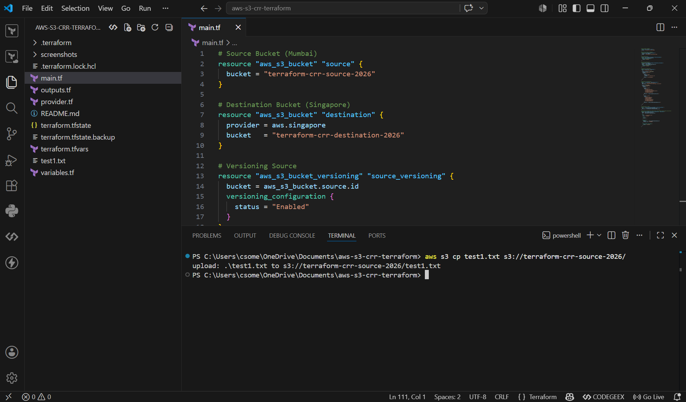
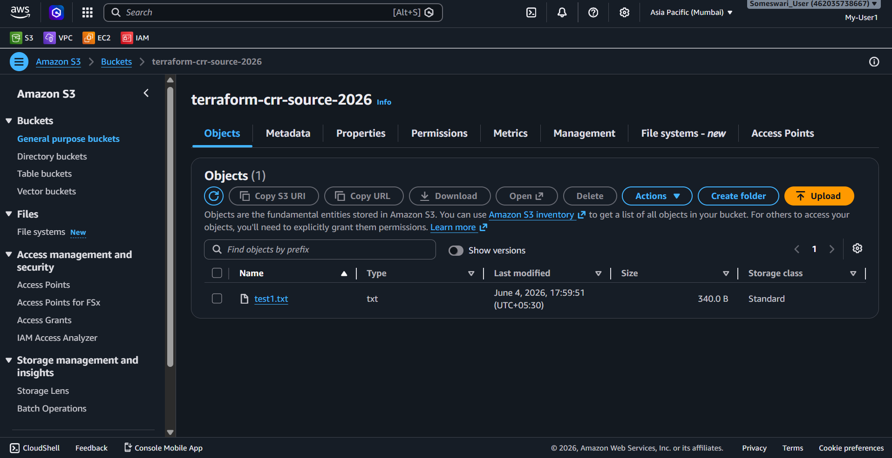

---
## 📝 Note:
S3 Cross-Region Replication (CRR) replicates only objects uploaded after the replication rule is enabled. If a file was uploaded before enabling replication, upload it again (or copy it onto itself) to trigger replication.

---
## 🚀 Step 9: Object Replication Status Completed in AWS Console

### 🎯 Objective:
- Verify that the object replication status is completed in the AWS console.

Output:
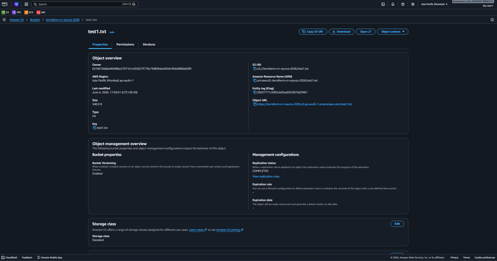

---
## 🚀 Step 10: File replicated to Destination Bucket 

### 🎯 Objective:
- Check that the file has been replicated to the destination bucket.

Output:
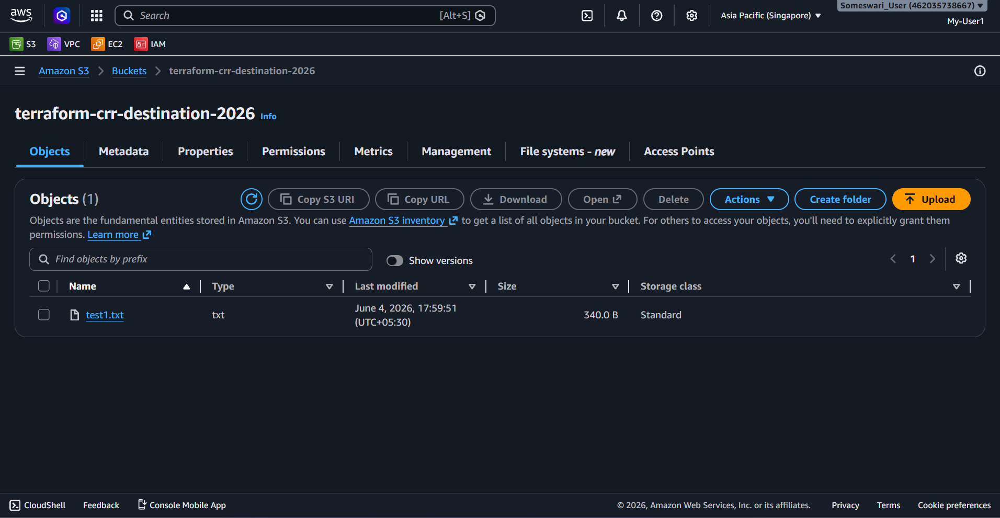

---
## 🧹 Cleanup
- Remove all AWS resources created by Terraform after testing the project.
- Avoid unnecessary AWS charges for resources that are no longer needed.
- Keep your AWS account clean by deleting temporary infrastructure.
```bash
terraform destroy
```
### 📌 What happens:
- Deletes the source S3 bucket.
- Deletes the destination S3 bucket.
- Deletes the IAM role used for replication.
- Deletes the IAM policy attached to the replication role.
- Removes the replication configuration created by Terraform.

### ⚠️ Note:
- Type `yes` when prompted to confirm the deletion of resources.

---
## 🎉 Conclusion
- This project demonstrates how to set up S3 bucket replication using Terraform.
- It covers the creation of source and destination buckets, IAM roles and policies, and replication configuration.
- The project also includes a test to verify that the file has been successfully replicated to the destination bucket.
- Finally, it provides instructions on how to clean up the resources created by Terraform.

---
## Author
- [someswari](https://github.com/chinthasomeswari577)

---
✅ This is a simple Terraform AWS S3 bucket replication example.

